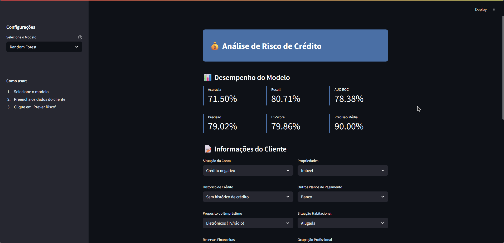

<h1 align="center">💰 Previsão de Inadimplência de Crédito</h1>

  Projeto de classificação de risco de crédito usando machine learning.

<h2>📌 Objetivo</h2>

Este projeto tem como foco a criação de modelos de aprendizado supervisionado para prever inadimplência com base em dados financeiros e demográficos de clientes.

<h2>📊 Dataset Utilizado</h2>
<ul>
  <li><strong>Fonte:</strong> UCI German Credit Dataset</li>
  <li><strong>URL:</strong> <a href="https://archive.ics.uci.edu/ml/datasets/statlog+%28german+credit+data%29" target="_blank">UCI Repository</a></li>
  <li><strong>Target:</strong> Previsão binária (0 = adimplente, 1 = inadimplente)</li>
</ul>

<h2>📁 Estrutura do Projeto</h2>
<pre>
analise-risco-credito/
├── report/
├── src/
│   ├── notebooks/        # Jupyter Notebooks (EDA e modelagem)
│   │   ├── eda.ipynb         # Análise Exploratória
│   │   └── all_models.ipynb  # Modelagem e avaliação
│   ├── models/           # Modelos gerados
│   └── app/              # Aplicativo Streamlit
│       └── app.py        # App Streamlit
└── requirements.txt      # Dependências necessárias
</pre>

<h2>🔍 EDA (Análise Exploratória)</h2>

O notebook <code>eda.ipynb</code> executa:

<ul>
  <li>Estatísticas descritivas</li>
  <li>Visualização de distribuições</li>
  <li>Boxplots e correlações</li>
  <li>Detecção de outliers</li>
</ul>

<h2>🤖 Modelos Treinados</h2>

  
Utilizamos 4 algoritmos clássicos com <code>RandomizedSearchCV</code> e <code>SMOTENC</code> para tratar desbalanceamento:

  <table>
    <thead>
      <tr>
        <th>Modelo</th>
        <th>Acurácia</th>
        <th>F1-Score</th>
        <th>ROC AUC</th>
        <th>AP (avg precision)</th>
      </tr>
    </thead>
    <tbody>
      <tr>
        <td>Regressão Logística</td>
        <td>70.0%</td>
        <td>0.776</td>
        <td>0.753</td>
        <td>0.870</td>
      </tr>
      <tr>
        <td>Random Forest</td>
        <td>71.5%</td>
        <td>0.799</td>
        <td>0.784</td>
        <td>0.900</td>
      </tr>
      <tr>
        <td>XGBoost</td>
        <td>70.0%</td>
        <td>0.789</td>
        <td>0.726</td>
        <td>0.846</td>
      </tr>
      <tr>
        <td>LightGBM</td>
        <td>72.5%</td>
        <td>0.803</td>
        <td>0.745</td>
        <td>0.864</td>
      </tr>
    </tbody>
  </table>

<h2>🖥️ Aplicação Streamlit</h2>

A interface <code>app.py</code> permite:

<ul>
  <li>Selecionar um modelo</li>
  <li>Inserir dados do cliente</li>
  <li>Visualizar as métricas do modelo</li>
  <li>Ver previsão e probabilidade de inadimplência</li>
</ul>

  

<h2>▶️ Como Executar</h2>

<h3>1. Clonar o repositório</h3>

<pre><code>git clone https://github.com/alineop120/projeto-analise-risco-credito.git
cd projeto-analise-risco-credito
</code></pre>

<h3>2. Criar ambiente virtual e instalar dependências</h3>

<pre><code>python -m venv .venv
source .venv/bin/activate   # Linux/macOS
.venv\Scripts\activate      # Windows

pip install -r requirements.txt
</code></pre>

<h3>3. Gerar os modelos (obrigatório)</h3>

Execute o notebook <code>all_models.ipynb</code> antes de iniciar a aplicação para gerar os arquivos <code>.pkl</code> e <code>.json</code> com os modelos treinados.

<h3>4. Rodar o app Streamlit</h3>

<pre><code>streamlit run app.py
</code></pre>

<h3>5. Rodar os notebooks</h3>

<ul>
  <li><code>eda.ipynb</code>: Visualize a estrutura dos dados</li>
  <li><code>all_models.ipynb</code>: Reproduza o pipeline de modelagem</li>
</ul>

<h2>📦 Dependências principais</h2>
<ul>
  <li>pandas, numpy, matplotlib, seaborn</li>
  <li>scikit-learn, imbalanced-learn</li>
  <li>xgboost, lightgbm</li>
  <li>streamlit</li>
</ul>

<h2>🧠 Observações Técnicas</h2>
<ul>
  <li>Modelos foram treinados com <code>StratifiedKFold</code> (k=10)</li>
  <li>Classificação binária com métricas otimizadas por <code>F1-Score</code> e <code>Average Precision</code></li>
  <li>Pipeline completo com <code>SMOTENC</code> + <code>ColumnTransformer</code></li>
</ul>

<h2>👥 Equipe</h2>

  
Projeto desenvolvido por alunos do curso de Ciência da Computação da Universidade Católica de Brasília (UCB)

<table>
  <tr>
    <th>Nome</th>
    <th>Matrícula</th>
    <th>GitHub</th>
  </tr>
  <tr>
    <td>Aline Oliveira</td>
    <td>UC23101158</td>
    <td><a href="https://github.com/alineop120">@alineop120</a></td>
  </tr>
  <tr>
    <td>João Victor</td>
    <td>UC23103118</td>
    <td><a href="https://github.com/itsryu">@itsryu</a></td>
  </tr>
  <tr>
    <td>Ana Beatriz</td>
    <td>UC23101592</td>
    <td><a href="https://github.com/Anabamorim">@Anabamorim</a></td>
  </tr>
  <tr>
    <td>Cristhiane Tamilly</td>
    <td>UC23200044</td>
    <td><a href="https://github.com/ctamilly">@ctamilly</a></td>
  </tr>
</table>

